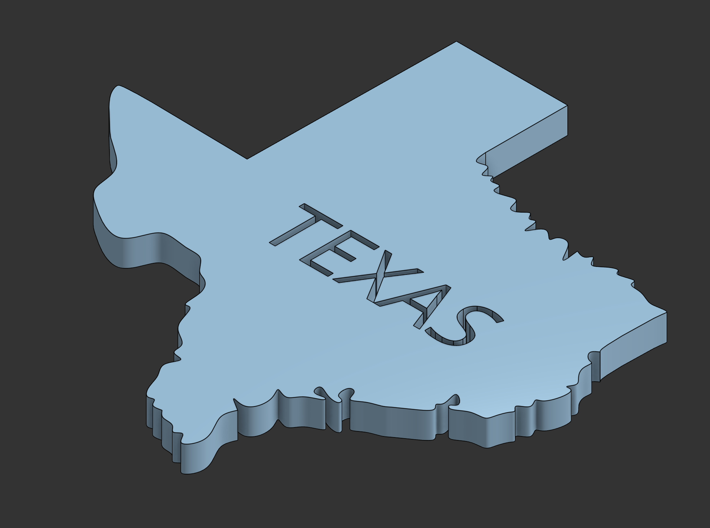

# Onshape CAD Designs

A collection of 3D CAD models I designed in [Onshape](https://www.onshape.com/) while learning parametric modeling.
Each design includes a render, the exported **STEP** and **STL** files, and notes on the techniques I used.

**Author:** Muhammad Ahmad Rao · [LinkedIn](https://linkedin.com/in/muhammadahmadrao-)
**Tools:** Onshape (sketching, part modeling, Render Studio)

---

## Designs

| Design | Preview | Techniques practiced | Files |
|---|---|---|---|
| [LEGO Brick](designs/lego-brick) |  | Sketching, extrude, patterns | [STEP](designs/lego-brick/models/lego-brick.step) · [STL](designs/lego-brick/models/lego-brick.stl) |
| [Cup](designs/cup) |  | Revolve, shell, fillet | [STEP](designs/cup/models/cup.step) · [STL](designs/cup/models/cup.stl) |
| [Texas Map](designs/texas-map) |  | Imported outline, extrude, text | [STEP](designs/texas-map/models/texas-map.step) · [STL](designs/texas-map/models/texas-map.stl) |
| [Dish Tray](designs/dish-tray) |  | Sketching, extrude, fillet, shell | [STEP](designs/dish-tray/models/dish-tray.step) · [STL](designs/dish-tray/models/dish-tray.stl) |

Coursework and early practice models live in [`coursework/`](coursework).

## Viewing the models

- Click any `.stl` file on GitHub to rotate and zoom it in the built-in 3D viewer.
- `.step` files open in Onshape, Fusion 360, FreeCAD, SolidWorks, and most other CAD tools.
- STL files are ready for slicing and 3D printing (Cura, PrusaSlicer, Bambu Studio).

## Repository structure

```
designs/        finished models (one folder each: images/, models/, README.md)
coursework/     assignments and practice work
assets/         images used in this README
```

## License

Released under the [MIT License](LICENSE). Feel free to learn from these models, and credit me if you reuse them.
