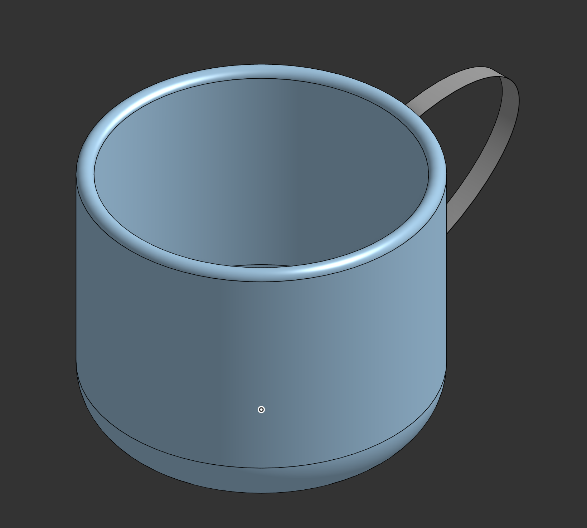

# Cup

## About
A simple cup with a handle, built from a revolved profile.

## Techniques used
- Revolve from a sketched profile
- Shell for wall thickness
- Fillet on the rim and base
- Sweep/extrude for the handle

## Design notes
- Units: millimeters

## What I learned
- How revolve turns a 2D profile into a round part
- Choosing wall thickness so the part stays printable

## Files
- 🔗 [Open in Onshape](https://cad.onshape.com/documents/ed88d786f95afac9d680d6e9/w/c8b30b7a6d5b76883fe30171/e/5b10632f5cb175dfe416d4d0?renderMode=0&uiState=6ac05e47a830cf066b6431ec)
- 📐 [STEP](models/cup.step) (editable in any CAD tool)
- 🖨️ [STL](models/cup.stl) (3D-print ready, previews in the browser)
