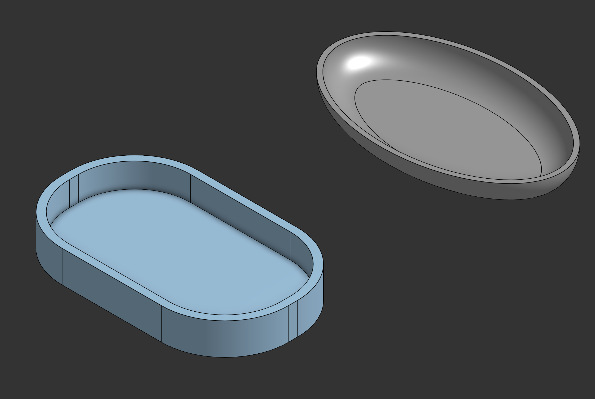

# Dish Tray

## About
A set of two shallow trays modeled in Onshape: a rounded-rectangle (stadium-shaped) tray with straight sides and a smooth, shallow oval dish. I designed them as a practice in turning simple sketch outlines into hollow, usable containers with clean rounded edges.

## Techniques used
- Sketching closed profiles (stadium and oval outlines)
- Extrude to create the solid body
- Fillet to round the edges
- Shell to hollow the body and set a consistent wall thickness
- Building two separate parts in one Part Studio

## Design notes
- Units: millimeters
- Design intent: small desk or kitchen trays for holding keys, coins or small items

## What I learned
- The order of features matters: fillet before shell, otherwise the shell can fail
- Rounded edges need a radius smaller than the wall thickness allows
- Keeping each part as its own sketch and feature chain makes problems easier to find and fix

## Files
- 🔗 [Open in Onshape](https://cad.onshape.com/documents/a28f954adad74a9e78ea8015/w/127ce4fd3db8e47d51c99434/e/3444faac008a3d02244f7165?renderMode=0&uiState=6ac05c55318fa855b9deba9a)
- 📐 [STEP](models/dish-tray.step) (editable in any CAD tool)
- 🖨️ [STL](models/dish-tray.stl) (3D-print ready, previews in the browser)
