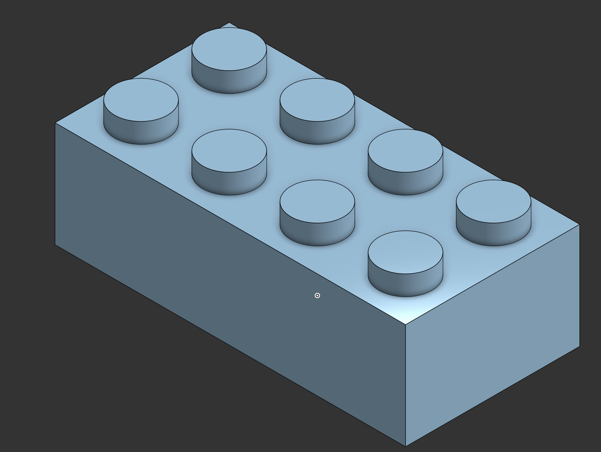

# LEGO Brick

## About
A parametric LEGO-style brick with studs on top and a hollow underside, modeled to standard-style proportions.

## Techniques used
- Sketching with dimensions and constraints
- Extrude (boss and cut)
- Linear / circular patterns for the studs
- Shell for the hollow underside

## Design notes
- Units: millimeters

## What I learned
- Keeping dimensions parametric so the brick can be resized
- Using patterns instead of redrawing repeated features

## Files
- 🔗 [Open in Onshape](https://cad.onshape.com/documents/47b649b07a7d8372db92f21b/w/2f7838db0e2fa1a21f20487e/e/31bcd28dbb46057f839e4c0d?renderMode=0&uiState=6ac05e1aa830cf066b6431a2)
- 📐 [STEP](models/lego-brick.step) (editable in any CAD tool)
- 🖨️ [STL](models/lego-brick.stl) (3D-print ready, previews in the browser)
